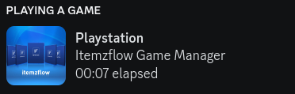

# PS5 Discord Rich Presence client




## What is this?
This is an client which will update your Discord Rich Presence with the game you're playing on your jailbroken PS5. 

It requires [etaHEN >= 1.4b](https://github.com/LightningMods/etaHEN) to be running and have the following entry enabled in the `/data/etaHEN/config.ini`:
```ini
[Settings]
discord_rpc=1
```
Advised to have an static IP for your PS5.

## Getting started
## 1. Setting up Discord
1. Go to the [Discord Developers](https://discord.com/developers) page.
1. On the top right side click 'New Application'. Name it 'Playstation' or how ever you like.
1. Select the application and copy the value named 'Application ID' and note it down.

## 2. Running the client

### Windows
1. Download the latest exe release from the [releases](https://github.com/jeroendev-one/ps5-rpc-client/releases) page.
1. Unzip the directory to a location of your choice.
1. Run the exe.

## Linux / MacOS
1. Clone this repo
1. Install dependencies with `pip3 install -r requirements.txt`
1. Run `python3 client.py` or `python client.py`
