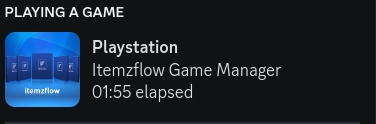

# PS5 Discord Rich Presence client



## What is this?
This is an client which will update your Discord Rich Presence with the game you're playing on your jailbroken PS5. 

It requires [etaHEN >= 1.4b](https://github.com/LightningMods/etaHEN) to be running and have the following entry enabled in the `/data/etaHEN/config.ini`:
```ini
[Settings]
discord_rpc=1
```
Advised to have an static IP for your PS5. 

## Setting up Discord
1. Go to the [Discord Developers](https://discord.com/developers) page.
1. On the top right side click 'New Application'. Name it 'Playstation' or how ever you like.
1. Select the application and copy the value named 'Application ID' and note it down.

## Running the client

### Windows
1. Download the latest exe release from the [releases](https://github.com/jeroendev-one/ps5-rpc-client/releases) page.
1. Open up Powershell (Admin)
1. Enter the following commands:
    ```cmd
    setx DISCORD_CLIENT_ID "<application id from Discord developers page>
    setx PS5_IP "192.168.xx.xx"
    ```
1. After this, close the Powershell window.
1. Unzip the release zip file
1. Run the exe file, profit!

## Linux
1. Clone this repo
1. Install dependencies with `pip install -r requirements.txt`
1. Set the environment variables:
```bash
export DISCORD_CLIENT_ID="13432423423"
export PS5_IP="192.168.xx.xx"
```
1. Run `python3 client.py` or `python client.py`


## Building yourself
1. Clone or download this repo.
1. `cd` in to the directory


## Docker build:
```bash
docker build -t ps5-rpc-client .
docker run -it --rm --name ps5-rpc-client ps5-rpc-client
```

